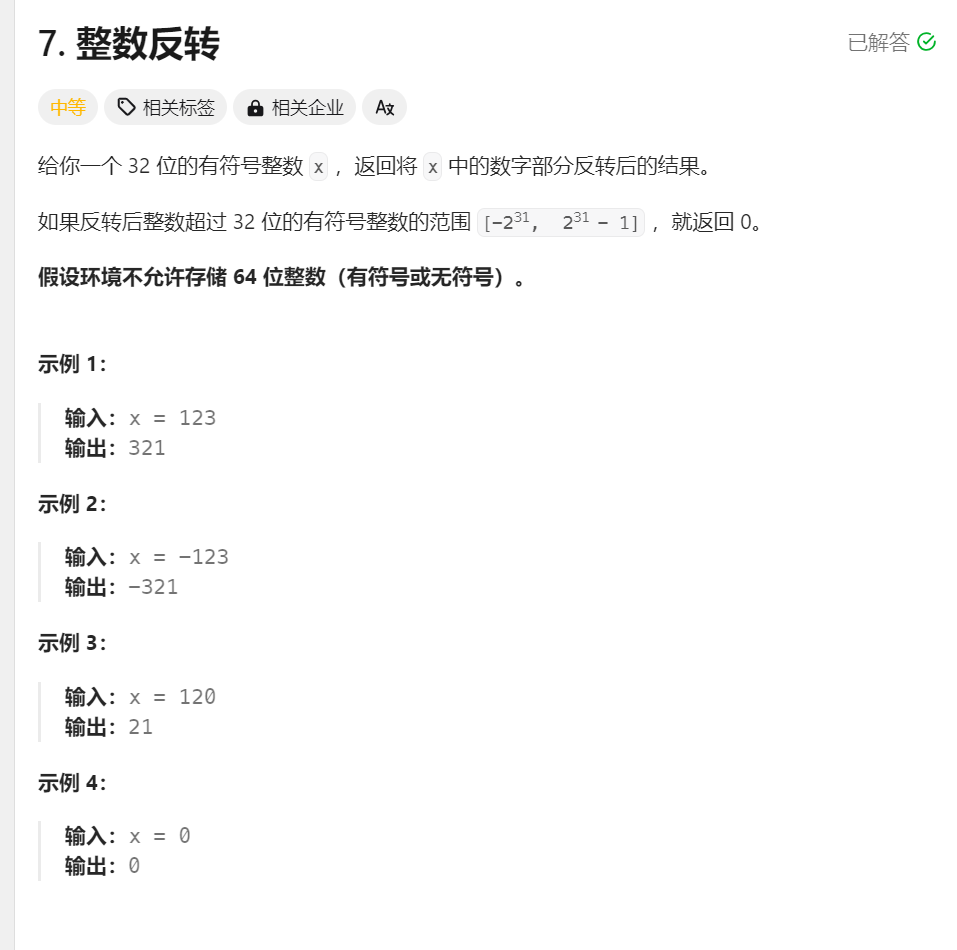
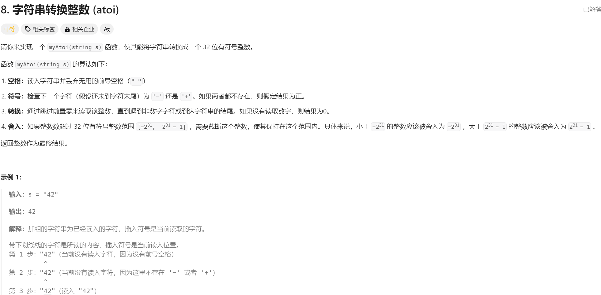
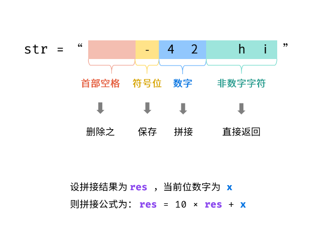
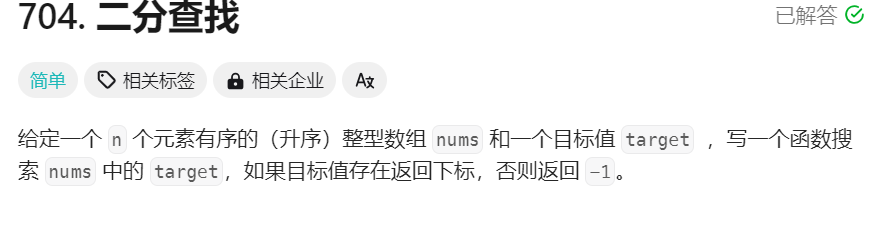
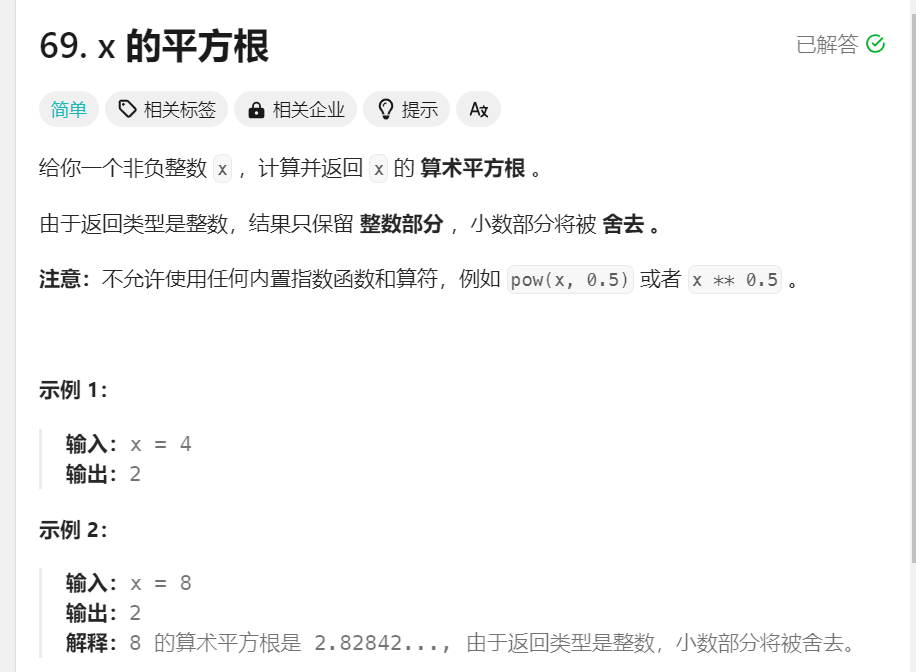
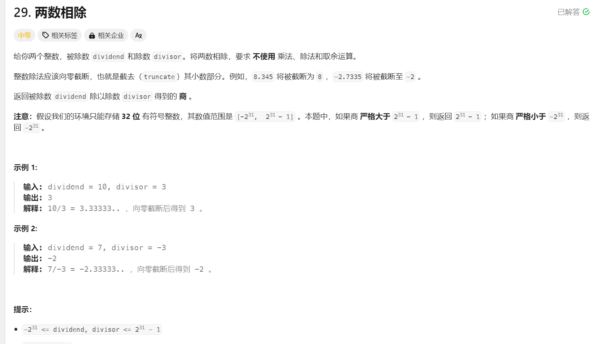

---

---

# chapter 1 .数学


##  1.取最小公倍数

- **题目描述**:给出两个整数,求出两个整数的最小公倍数

###     方法Ⅰ:暴力枚举

   从大数开始枚举,容易超时。


###      方法Ⅱ: 欧几里得算法(求最大公约数)

$$
LCM(n,m)=\frac{n*m}{GAC(n,m)}
$$

- LCM为最小个公倍数

- GAC为最大公约数 

  那么该公式在代码实现上需要注意什么呢?

     首先是**整数溢出**的问题：在运算过程中若先调用（n*m）很容易出现**整数溢出的情况**这时，应当考虑先除后乘**减小运算过程中的中间数值**

    同时res=LCM(n，m)应当尽量取long long int 考虑**n=100001 m=100000**的情况

  

  **那么剩下的问题就是如何取最大公约数？**

  ###  欧几里得算法：

  思想：若两数为n与m（n>m),那么**k=(n-m)**也必然为其**最大公约数的整数倍**，那么**k与m的最大公约数也为GAC**

  

####                   欧几里得算法代码实现

```C++
int gcd(int n ,int m)
{ 
   //假定n为大数
   while(m!=0)
   {
      int temp = n%m;
      n= m;
      m= temp;
   }
    //当循环结束 大数为所需的值,小数为0
   return n;
}
```

考虑m>n?  **yy**一下,很好想到,在m>n时,while循环内部操作其实就相当于进行了**一次交换**操作妙不妙!!!!!

-   递归实现

```c++
int gcd(int n ,int m)
 {
   if(m==0) return n;
   else return(gcd(m,n%m));
 }
```


___


## 2. leeetcode.7*整数反转(爆int)(非常重要)*

###  

https://leetcode.cn/problems/reverse-integer/description/



####    鄙人在一开始解题时犯的错误：

1. 没有想到用一个sign来记录x的正负，导致后面需要重复确认x的正负
2. 本来想用temp来承接|x| ,但是没有想到 **|-2^31|会直接导致整型溢出**!! 
3. 没有考虑到在进行运算的过程中如果出现**中间值大于int的范围**,也会发生整型溢出

   题目要求：若反转后超出int范围直接返回0

```c++
if(sign<0 && res*10+temp< INT_MIN) return 0 ; //其中temp为当前位上的数值[0,9]
if (sign >0 && res*10 -temp>INT_MAX) return 0;
```

这样写确实满足了如果说res将要转化的值将要超出int范围 ,直接return 0 ;

**但是!!! ,有没有考虑到在res*10本身也有可能发生爆int!!!**即在运算过程中发生整数溢出。

解决方案: **运算右移即可**

```c++
if(sign<0 && res< (INT_MIN+temp)/10） return 0 ; //其中temp为当前位上的数值[0,9]
if(sign >0 && res> (INT_MAX-temp)/10) return 0;
```

####     题解:

```c++
class Solution {
public:
    int reverse(int x) {
          int res =0
          int sign = (x>0)? 1:-1;
          while(x!=0) //x<0也可以进行取余运算
          {
              int temp = sign*(x%10) //sign 保证了temp只反映位上数值大小[0.9]
              if(sign<0 &&　res< (INT_MIN+temp)/10） return 0 ;
              if(sign >0 && res> (INT_MAX-temp)/10) return 0 ;
              x/=10;
              res = res*10 +sign*temp //因为res为负数 实际上是减去一个temp
          }
          return res;
    }
};
```

####     收获:

- 运算过程中发生整数溢出,如果需要比较可以**考虑算术右移**
- sign表示输入的正负,还可以方便后续赋值操作!!
- 负数也可以进行区取余运算

## 3.leetcode.8[字符串转整数](https://leetcode.cn/problems/string-to-integer-atoi/description/)



根据题目描述,结果应当符合如下规则:

- 字符串前置空格可以直接跳过。

- 跳过空格后**只要对首个非空字符串识别是否为'+' '-'** ,

  若为'-'则sign=-1,且索引+1 若为'+'不处理,因为默认的sign=1(记得索引+1)

  若为其他字符串,交给while循环处理

- while循环负责处理整数问题:

  - 如果遇到非数字部分,直接跳出循环

  - 如果遇到数字部分:

    - res=0 且 s[index]='0': 此时跳过该字符

    - 其他: 写入 (注意:写入需要判断会不会爆int!!!!处理方式与leetcode7很像),

    - 注意**字符的转int型:**
      $$
      temp = ascii(s[index]) - ascii('0')
      $$
      

​                                              

###             3.2 完整实现:

```c++
class Solution {
    //如果读取的第一个字符后直接停止
public:
    int myAtoi(string s)
    {
           int index =0 ;
           int sign=1;//default
           int res =0;
           int res_len =0;
           int temp =0;
           while(s[index]==' ' && index<s.length()) 
           {index++;}
           if(s[index]=='+') index++;
           else if(s[index]=='-') 
           {
             sign=-1;
             index++;
           }
           while(index <s.length())
           {
             if(s[index]=='+'||s[index]=='-'||s[index]=='.'
                           ||s[index]==' '||isalpha(s[index]))                      
             {  
                break;
             }
             else if(isdigit(s[index]))
             {
                if(res_len==0&& s[index]=='0')
                 {  
                    index++;
                    continue;
                 }
                else 
                {
                    temp = s[index]-'0';  //记录下来
                    if(res<=(INT_MAX-temp)/10 && sign ==1)
                          {res= res*10+temp*sign; //注意需要乘sign 如果不乘想留在return乘会爆int
                          res_len++;}
                    else if(res>(INT_MAX-temp)/10 && sign==1) return INT_MAX ;
                    if(res>=(INT_MIN+temp)/10 && sign ==-1)
                        { res = res*10+temp*sign; 
                          res_len++;}
                    else if(res<(INT_MIN+temp)/10&& sign ==-1) return INT_MIN;
                }
             }
             index++;
           }
           return res;     
    }
};
```


## 4.二分法


### 4.1 二分查找  [leetcode.704](https://leetcode.cn/problems/binary-search/description/) 




- 当进行二分查找时需要明确区间范围的开与闭,这样在编代码时,才能明确各种比较的写法:

- 二者对比:

  ```c++
  int search()
  {
      int left = 0 , right = numsSize;
      int res =0;
      int mid ;
      while(left<=right)
      {
          mid = (left+right)/2 ;//这里无需考虑爆int情况 因为索引小于INT_MAX
          if(nums[mid] >target)
          {
              right = mid-1;    
          }
          else if(nums[mid]<target)
          {
              left = mid+1;
          }
          else return mid;
      }
      /*左闭右开
      while(left<right)
      {
        if(nums[mid]<target)
        {
           right = mid;
        }
        else if(nums[mid]<target)
          {
              left = mid+1;
          }
        else return mid;
      }
      */
      return -1
  }
  ```

- 其实只要注意到while循环内部的条件实际上指的是左右边界应当使得**区间有效**!!

  递归写法(可以课后实现一下)


### 4.2 二分查找的变式[leetcode.69](https://leetcode.cn/problems/sqrtx/)




```c++
class Solution {
public:
    int mySqrt(int x) {
       int mid ;
       int left =0 ,right = x ;
       int ans ;
       while(left<=right)
       {
          //在本题中中间数就是索引
          mid = left+ (right - left)/2 ; //很细节防止爆int
          if((long long)mid*mid <= x)
          {
             ans = mid;//结果暂存
             left = mid+1;
          }
          else 
          {
            right = mid-1;
          }
       } 
       return ans;
    }
};
```

- ##### 最重要的是理解while循环内if((long long )mid*mid <=x)

  - long long 类型强制转换防止爆int

  - **mid *mid <= x**? why?

    很容易知道: 最终结果ans的平方要么会等于x 要么会小于x(只取了x开平方的整数部分)。 因此在if内部需要**对ans进行赋值操作**。

    我们设想一下:假设某一次mid正好指向了所需要的ans那么 ,执行第一次边界变换:left=mid+1   **由于此后,只会存在mid的平方大于x的情况,**因此在最后会有**right<left**导致循环结束 return ans

  

### 4.2快速幂(二分加速)

- 适用场景: 一般是求a^b ,且题目会给一个数字让你求出a^b对其求余的结果,如果说直接暴力计算,不说会造成高时间成本,还会有**整数溢出的风险**

​    这时二分加速就派上了用场。

   求出a^b的二分加速方法(不考虑爆int的情况好吧,且a>=1, b>0)

```c++
int b_speed_up(int a ,int b)
{
    int res =1;
    if(b==0) return 1;
    while(b>0)
    {
        if(b%2>0) res*= a ;
        else 
        {
            a = a*a;
            b/=2;
        }
    }
    return res ;
}
```


### 4.3快速乘(也是二分加速)[leetcode.29两数相除](https://leetcode.cn/problems/divide-two-integers/description/)



- #### 思路:

  1. 用二分查找,不断逼近最终的返回值
  2. 如何逼近返回值 ,用快速乘判断 当前中间指针所指的数是小是大?
  3. 那么由于二分查找啊的范围是在[1,INT_MAX]之间,(后续会根据情况,调整正负),那么这就需要在正式开始二分查找之前判断好INT_MIN 以及为0 的一些情况;

####    4.3.1 快速乘在本题中的具体实现:

```c++
public:
    bool quick_add(int divisor ,int res, int dividend)
    {
     // 需要满足divisor *res >= dividend  注意divisor 和dividend都是负数!!!!
        int add =divisor;
        int ans =0;
        while(res  )
        {
            if(res & 1 ) //判断res 是否为奇数 
            {
                if(ans <dividend-add) return false ;
                ans += add;
            }
            if(res != 1)//注意这里!!!
            {
              if(add < dividend-add)　return false ;  //会存在 add*2>dividend的情况
              add +=add ;
            }
            res>>=1; //相当于res/=2  <-> res = res>>1
        }
        return true;
    }
```

####     4.3.2主体的代码实现

```c++
public:
    int divide(int dividend, int divisor) 
    {
        //考虑被除数为最小值的情况
          if (dividend == INT_MIN) {
            if (divisor == 1) {
                return INT_MIN;
            }
            if (divisor == -1) {
                return INT_MAX;
            }
        }
        // 考虑除数为最小值的情况
        if (divisor == INT_MIN) {
            return dividend == INT_MIN ? 1 : 0;
        }
        // 考虑被除数为 0 的情况
        if (dividend == 0) {
            return 0;
        }

        bool if_negative = false ;
        if(dividend>0)
         {
            if_negative = !if_negative;
            dividend = -dividend;
        }
        if(divisor> 0) 
        {
            if_negative = !if_negative;
            divisor = -divisor;
        }

        int left = 1  , right = INT_MAX;
        int ans =0 ;
        while(left<= right)
        {
            int mid = left + ((right-left)>>1);
            if(quick_add(divisor, mid , dividend))
            {
                ans = mid;
                if(mid==INT_MAX) break;
                left = mid + 1 ;
            }
            else right = mid-1;
        }
        return (if_negative) ? -ans: ans;
        
    }
```

