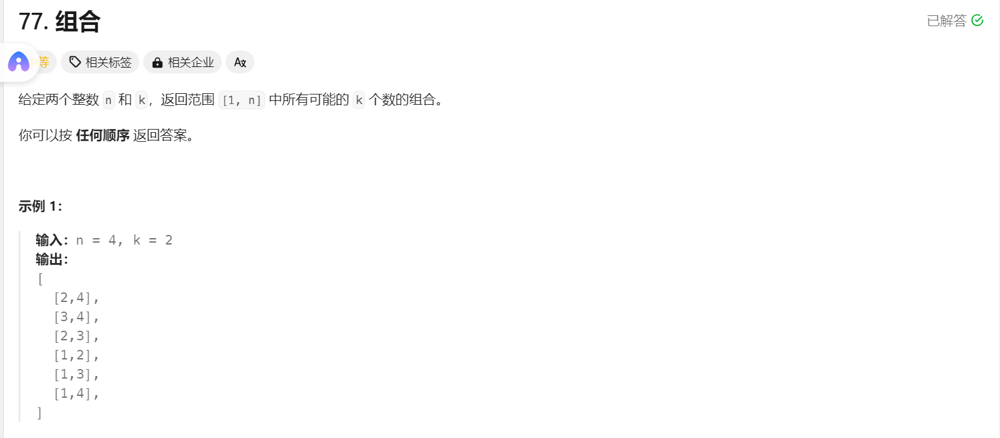
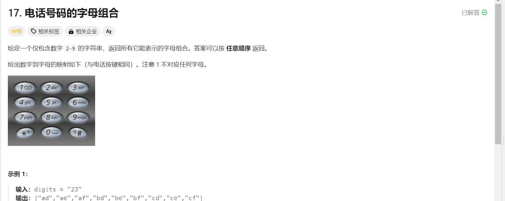
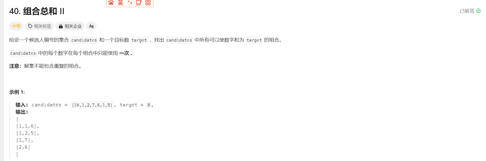
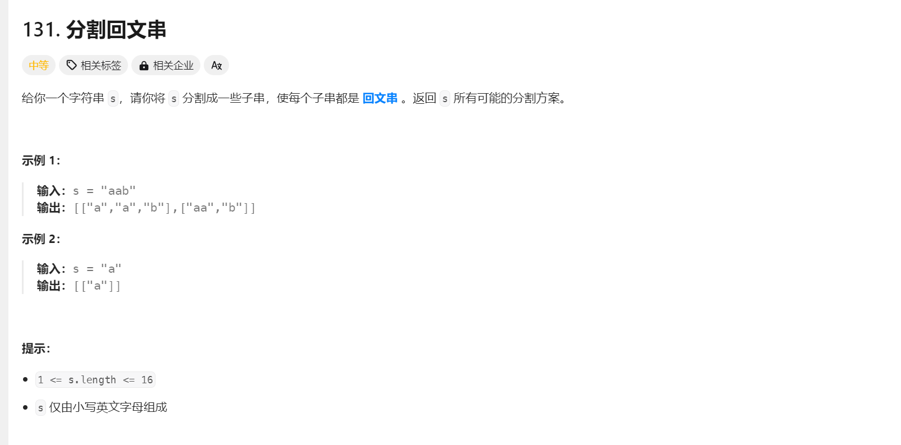
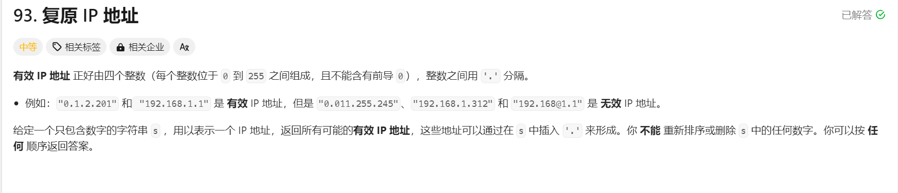
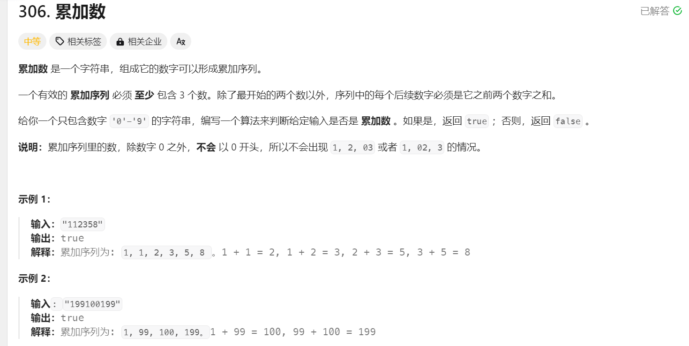
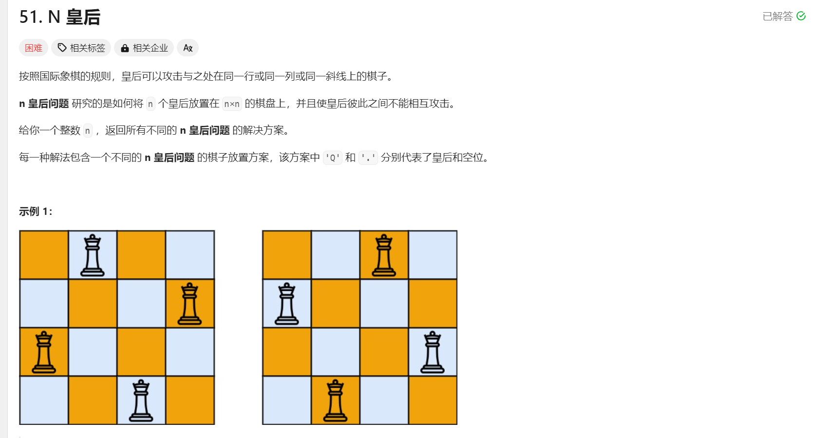
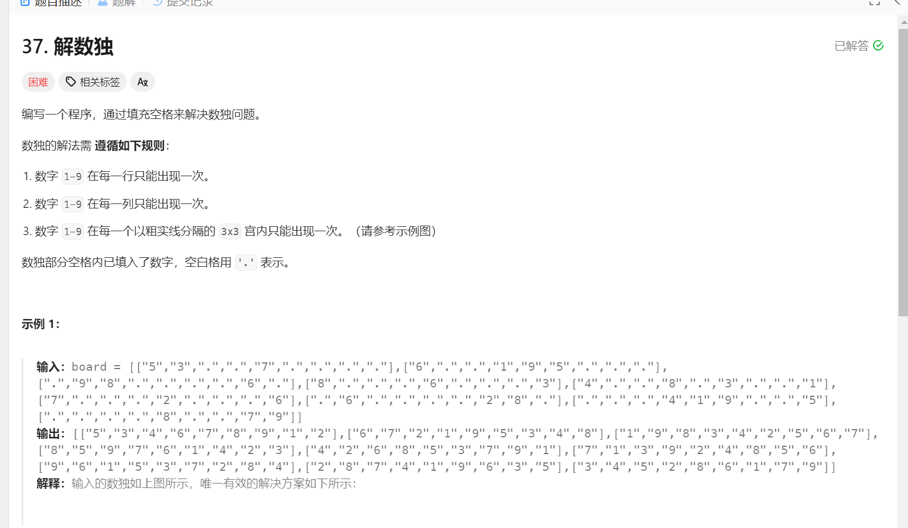

# 回溯算法

由于有些问题无法通过for循环直接求出, 需要用到回溯算法, 

回溯算法需要用到递归, 在分析结构时,不要按照代码运行逻辑进行分析, **而应当抽象成一颗多叉树**(每个节点都是一个返回值)

```c++
status backtracking(....)
{
    if(终止条件)
    {
        return ...;
    }
    for(auto it : range)
    {
        return ...;
    }
}
```


## 1.1 组合问题


### 	1.1.1 [77组合问题](https://leetcode.cn/problems/combinations/description/)



**回溯算法占用空间并且费时, 请 二刷时一题多解**

```c++
class Solution {
public:

    vector<vector<int>> res ;
    void backtracking(int cur_num,int n ,int k , vector<int> arr){
        if((n-cur_num+1)<k-arr.size()) return ; //可填充的数据少于需要填充的数据
        if(arr.size()==k)
        {
            res.push_back(arr);
            return ;
        }
        for(int i = cur_num ; i <=n ; i++)
        {
            arr.push_back(i);
            backtracking( i+1,n , k , arr);
            arr.pop_back(); //回到上一个节点 继续添加
        }
    }
    vector<vector<int>> combine(int n, int k) {
        vector<int> arr;
        backtracking(1,n,k,arr);
        return res ;  
    }
};
```


### 	1.1.2 [电话号码](https://leetcode.cn/problems/letter-combinations-of-a-phone-number/description/?envType=problem-list-v2&envId=xhXnJaos)



```c++
class Solution {
public:
    vector<string> res ;
    unordered_map<int ,string> hash_table ;
    void backtracking( int digits_idx ,string words ,string digits)
    {
        if(words.size()==digits.size())  
        {
            res.push_back(words);
            return ;
        }
        int num = digits[digits_idx] - '0';
        for(int i = 0 ; i<hash_table[num].size();i++)
        {
            words.push_back(hash_table[num][i]);
            backtracking(  digits_idx+1, words , digits);
            words.pop_back();
        }
    }        
   
    vector<string> letterCombinations(string digits) 
    {
        if(digits=="") return res;
        hash_table[2] ="abc";
        hash_table[3] ="def";
        hash_table[4] ="ghi";
        hash_table[5] ="jkl";
        hash_table[6] ="mno";
        hash_table[7] ="pqrs";
        hash_table[8] ="tuv";
        hash_table[9] ="wxyz";
        backtracking(  0 ,"",digits);
        return res;
    }
};
```

**做这道题需要注意一下: 只有当需要访问下一个键值对,即下一个数字时,才算是进入下一层递归**


### 	1.1.3 [组合问题Ⅱ](https://leetcode.cn/problems/combination-sum-ii/description/)



遇到此题首先先排序-----升序排列

如果说采用`leetcode39组合总和`的代码会发现**由于原数组存在两个重复的1**导致返回式中有重复的组合。

导致这样是由于该循环的无记忆性, 即在同一树层中的处理是完全相互独立的

```c++
class Solution {
public:
   vector<vector<int>>ans;
   vector<int>path;
   void backtrack(vector<int>& candidates, int target,int index){
       if(target==0){
           ans.push_back(path);
           return;
       }
       for(int i=index;i<candidates.size();i++){
             if(target-candidates[i]<0) continue  ;
             else 
             {
                path.push_back(candidates[i]);
                backtrack(candidates , target-candidates[i] , i);
                path.pop_back();
             } 
           }
       }
   
   vector<vector<int>> combinationSum(vector<int>& candidates, int target) {
       sort(candidates.begin(),candidates.end());
       backtrack(candidates,target,0);
       return ans;
   }
};
```

我们考虑加入一个bool类型数组`used`来记录每个元素的使用情况,

```c++
	vector<bool> using ; //表示正在使用
    vector<vector<int>> combinationSum2(vector<int>& candidates, int target) {
        // 初始化
        res.clear();
        path.clear();
        using.assign(candidates.size(), false); //初始化

        // 排序以便于去重
        sort(candidates.begin(), candidates.end());  
        backtrack(candidates, target, 0);
        return res;
    }
```

<font color= red>**由于题干允许树枝重复,但是不允许树层重复**</font>

**如果说 前一个元素和当前元素值相同且正在使用,那么说明可以使用当前元素**

**如果说 前一个元素和当前元素值相同且不在使用, 那么说明不可以使用当前元素**

```c++
        for (int i = idx; i < candidates.size(); i++) {
            // 跳过重复元素
            if (i > 0 && candidates[i] == candidates[i-1] && !using[i-1]) continue;

            // 如果剩余的目标值小于当前候选值，则结束循环
            if (target - candidates[i] < 0) continue;

            path.push_back(candidates[i]);
            using[i] = true;
            backtrack(candidates, target - candidates[i], i + 1);
            using[i] = false;
            path.pop_back();
        }
```


## 1.2 分割问题


### 	1.2.1  [leetcode131 分割回文串](https://leetcode.cn/problems/palindrome-partitioning/description/)



看似无从下手,实际上回文串的分割也可以模拟回溯过程。

在进行回溯代码构建之前,我们需要一个**判断字符串是否为回文字符串的代码**:

```c++
    //原来判断回文也可以这么写!!!!!
	bool isPalindrome ( string s , int start, int end)
    {
        while(start<end)
        {
            if(s[start]!=s[end]) return false ;
            start++;
            end--;
        }
        return true ;
    }
```


好那么我们来分析回溯部分怎么编写:

在每一层递归代码执行前需要传入本次递归在字符串中索引的开始`start`, 这个`start` 是由于前面(到start-1结束)出现了回文字符串,故进行了分割,而分割后,新的子字符串起点为`start`;

```c++
        for(int i =start ; i<s.size();i++)
        {
            if(!isPalindrome(s,start,i)) continue ; //若[start,i(end)] 非回文字符串
            path.push_back(s.substr(start,i-start+1));
            backtrack(s, i+1);  //start= i+1 ,进行切割
            path.pop_back(); //回溯
        }
```

那么递归的终点就是---**完成了对字符串的切割,即start>=s.size()** 

```c++
        if(start>=s.size())
        {
            res.emplace_back(path)  ;
            return ;        
        }
```


**完整实现:**

```c++
class Solution {
public:
    vector<vector<string>> res ;
    vector<string> path ;
    bool isPalindrome ( string s , int start, int end)
    {
        while(start<end)
        {
            if(s[start]!=s[end]) return false ;
            start++;
            end--;
        }
        return true ;
    }
    void backtrack(string s , int start)
    {
        if(start>=s.size())
        {
            res.emplace_back(path)  ;
            return ;        
        }
        for(int i =start ; i<s.size();i++)
        {
            if(!isPalindrome(s,start,i)) continue ;
            path.push_back(s.substr(start,i-start+1));
            backtrack(s, i+1);
            path.pop_back();
        }
    }
    vector<vector<string>> partition(string s) 
    {
        backtrack(s,0);
        return res;
    }
};
```


### 	1.2.2 [ leetcode93. 复原 IP 地址](https://leetcode.cn/problems/restore-ip-addresses/)



**<font size=4>设计思路:</font>**

- 设计一个**`count` 来记录切片次数 ,当切片数`==3`时准备返回(这个设计很巧妙**,注意不是上题的`start>=s.size()`)

```C++
        if(count==0)
        {
            if(!isValid(s,start , s.size()-1)) return ; //需要判断最后一个字符串是否合法
            res.push_back(s); 
            return ;
        }
```

- 设计一个函数`isValid(string & s, int start ,int end)`来确保预切割的字符串是否合法

```c++
    bool isValid(string s, int start , int end )
    {
        if(start>end) return false ;

        string temp = s.substr(start , end-start+1);
        if((temp[0]=='0'&& temp.size()>1) || temp.size()>3||stoi(temp)>255)
        {
            return false;
        }
        return true;
    }
```

[^if(start&gt;end) return false ;]: 注意一定要判断是否字符串长度为零

- 在遍历时直接在`string s`上进行'.'的插入 , 如果想传入temp 临时变量存储string太麻烦了

```c++
        for(int i = start ; i<s.size();i++)
        {
            if(!isValid(s, start ,i)) return  ;
            s.insert(i+1 , 1,'.');
            backtrack(s, i+2 , count-1);
            s.erase(i+1 , 1);
        }
```


**<font size=4>具体实现:</font>**

```c++
class Solution {
public:
    vector<string>res;
    bool isValid(string s, int start , int end )
    {
        if(start>end) return false ;
        //取数
        string temp = s.substr(start , end-start+1);
        if((temp[0]=='0'&& temp.size()>1) || temp.size()>3||stoi(temp)>255)
        {
            return false;
        }
        return true;
    }
    void backtrack(string s , int start , int count)
    {
        if(count==0)
        {
            if(!isValid(s,start , s.size()-1)) return ;
            res.push_back(s);
            return ;
        }
        for(int i = start ; i<s.size();i++)
        {
            if(!isValid(s, start ,i)) return  ;
            s.insert(i+1 , 1,'.');
            backtrack(s, i+2 , count-1);
            s.erase(i+1 , 1);
        }
    }
    vector<string> restoreIpAddresses(string s) 
    {
        if(s.size()<4|| s.size()>12) return vector<string>();
        backtrack(s,0 ,3);
        return res ;
    }
};
```


### 	1.2.3 leetcode306累加数 



#### 方法Ⅰ

- #### 思路:

一开始题目没有理解 , 还是那句话审题!!!!! 累加 ,  什么是累加 ,当一段数据进入加法计算的时候 , 那段数据的值是定的!!!

那么回溯思路出来了, 每次进行回溯时需要传入`index`  即当前遍历起点(因为`index` 之前的所有数字都已经被去除)  如果遍历完整个数组 ,发现都没有合法的截取方式那么直接return false

进入循环 每次 会截取一段字符串并将其转化为`long double` 类型 存入 `path`中  并进入下一层循环  

```c++
 if(dfs(num.substr(i+1), tmp )) return true;
```

在每次循环开始时 会进行**合法性判断**

```c++
 if(n>=3 && tmp[n-1] != tmp[n-2]+tmp[n-3]) return false;
```

**递归终点**

```c++
  if(num.size()==0 && n>=3) return true;
```


```c++
class Solution {
public:
    bool isAdditiveNumber(string num) {
        vector<long double>tmp;
        return dfs(num,tmp);
    }
    bool dfs(string num,vector<long double>& tmp){
        int n = tmp.size();
        if(n>=3 && tmp[n-1] != tmp[n-2]+tmp[n-3]) return false;
        if(num.size()==0 && n>=3) return true;
        for(int i = 0;i<num.size();++i){
            string cur = num.substr(0,i+1);
            if(cur[0]=='0' && cur.size()!=1) continue;
            tmp.push_back(stold(cur));
            if(dfs(num.substr(i+1),tmp)) return true; //递归后发现合法
            tmp.pop_back(); //如果递归结束 
        }
        return false;
    }
};
```


## 1.3 N皇后 & 解数独


### 	1.3.1 [leetcode51 N皇后](https://leetcode.cn/problems/n-queens/description/)



**解题思路:**

- 按行进行遍历 ,每遍历至一行说明进入**下一层递归, 下一个树层**

- 在行中遍历每个cell时, 需要调用函数`iflegal(int col, int row ,  vector<string>&path )`判断在该cell中插入元素是否合法 **若不合法**`continue`

  

- 在`iflegal(int col, int row ,  vector<string>&path )` 中 需要判断   所在列 , 45° , 135°是否有其他皇后

```c++
bool ifAttack(int col , int row ,int n , vector<string>&path)
{
    for(int i = 0 ; i<row;i++)  //无需将整列遍历
    {
        if(path[i][col]=='Q' ) return true ;
    }
    //45°
    for(int i = row-1 ,  j = col+1 ; i>=0 && j<n ;i-- , j++) //45°
    {
        if(path[i][j]=='Q')  return true ;
    }

    for(int i = row-1 ,  j = col-1 ; i>=0 && j>=0 ;i-- , j--) //135°
    {
        if(path[i][j]=='Q')  return true ;
    }
    return false ;
}
```


**具体实现:**

```c++
class Solution {
public:
    vector<string> path ;
    vector<vector<string>>res ;
    bool ifAttack(int col , int row ,int n , vector<string>&path)
    {
        for(int i = 0 ; i<row;i++)
        {
            if(path[i][col]=='Q' ) return true ;
        }
        //45°
        for(int i = row-1 ,  j = col+1 ; i>=0 && j<n ;i-- , j++)
        {
            if(path[i][j]=='Q')  return true ;
        }

        for(int i = row-1 ,  j = col-1 ; i>=0 && j>=0 ;i-- , j--)
        {
            if(path[i][j]=='Q')  return true ;
        }
        return false ;
    }
    void backtrack(int n ,  int row , vector<string>& path )
    {
        if(row== n)
        {
            res.emplace_back(path);
            return ;
        }
        for(int i = 0 ; i< n ; i++)
        {
            if(ifAttack(i , row , n,path)) continue ;
            path[row][i] ='Q';
            backtrack(n , row+1 , path);
            path[row][i]='.';
        }
    }
    vector<vector<string>> solveNQueens(int n) 
    {
        string s ;
        for(int i  = 0 ; i<n ;i++)
        {
            s+='.';
        }
        path.insert(path.begin(),n, s);
        backtrack(n , 0 , path);

        return res ;
    }
};
```


### 	1.3.2 [leetcode37 解数独](https://leetcode.cn/problems/sudoku-solver/description/)



**解题思路:**

在以往的递归函数的题目中, 都是采用单层循环, 而在该题中 需要采用双层循环, 因为每遍历到一个`cell`就相当于进入下一个树层 (也很好理解)

而对于每个`cell`需要从1-9 进行遍历,查看各个数是否合法`isValid()`, 如果合法则填入该数并进行下一层递归,当然如果在递归中出现无可填数字即1-9 都不合法 那么程序返回false , 并进行回溯 回归到之前的某个状态 

结束:假设board被填满 , 遍历到了最后一个`cell`**发现无**`board[i][j]=='.'`**的情况** ,说明已收集成功正确结果 程序退出 并返回true ;

 <font color = red>注意:需要注意栈溢出｀stack overflow｀的情况 , 说明当前递归层数过多</font>

```c++
class Solution {
public:
    bool isValid(int col , int row ,int x , vector<vector<char>>& board )
    {
        for(int i = 0 ; i< 9 ; i++)
        {
            if(board[i][col]=='0'+x) return false ;
            if(board[row][i]=='0'+x) return false ;
        }
        int  start_col = (col/3)*3 ;
        int  start_row = (row/3)*3 ;
        for(int i = start_row ; i<start_row+3 ; i++)
        {
            for(int j = start_col ; j<start_col+3 ; j++)
            {
                if(board[i][j]==x+'0') return false ;
            }
        }
        return true ;
    }
    bool backtrack(vector<vector<char>>& board)
    {
        for(int i = 0 ; i<board.size(); i++)
        {
            for(int j = 0 ; j<board[0].size(); j++)
            {
                if(board[i][j]=='.')
                {
                    for(int x = 1 ; x<10 ; x++)
                    {
                        if(isValid( j ,  i ,  x ,  board))
                        {
                            board[i][j] =  '0'+x ;
                            if(backtrack(board)) return true ;
                            board[i][j] = '.';
                        }
                    }
                    return false ;
                }
            }
        }
        return true ;
    }
    void solveSudoku(vector<vector<char>>& board) 
    {
        backtrack(board);
    }
};
```


## 1.4 奇技淫巧


