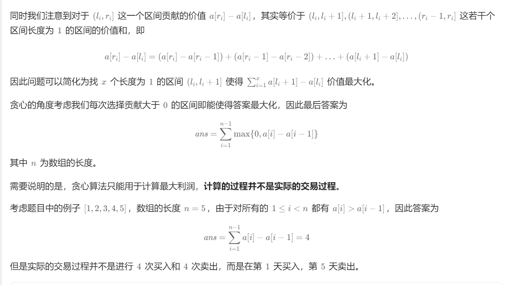

# 贪心算法


##    1.有关数字序列(坡度问题)

###    1.1 [leetcode378 摆动序列](https://leetcode.cn/problems/wiggle-subsequence/description/)


摆动序列有三种情况:上坡  下坡  平坡

默认在nums中有一个元素则  res = 1 ,仅有一个 上坡或下坡 res =2

- 首先判断数组元素个数是否为1 

  ```c++
  if(nums.size()==1) return 1 ;
  ```

- 若不为1 ,开始进行初始化

  ```c++
  int pre_diff = 0 ;//假设在nums[0] 前有 nums[-1] 且nums[0]=nums[-1]
  int cur_diff  ; //进入循环再初始化也不迟
  int idx = 0;
  int res =1 ;
  ```

- 进入循环,也是本题的关键

  ```c++
  while(idx+1 <nums.size())
  {
      //每次循环前初始化 cur_diff
      cur_diff = nums[idx+1] - nums[idx];
      if(cur_diff>0 && pre_diff<=0 || cur_diff<0 && pre_diff>=0) //pre可取等               {
           res++ ;
           pre_diff = cur_diff; //只有遇到了拐点再更新pre 就无需考虑一直上坡或者出现平坡的情况
        } 
      idx++;
  }
  ```


###    1.2 [leetcode 738 单调递增的数字]( https://leetcode.cn/problems/monotone-increasing-digits/description/ )-----上坡

- 
- **大致思路**:
  1. 找到下坡的位置 即第一个：`strn[idx]<strn[idx-1]`的位置
  2. 若一直是非下坡 直接return
  3. 尝试反向遍历字符串整数若满足`strn[idx-1]>strn[idx]`则对`strn[idx-1]--`
  4. 最后遍历终止 ,将后面所有位数变为'9'

```
class Solution {
public:
    int monotoneIncreasingDigits(int n)
    {
        string strn = to_string(n);
        int idx = 1 ;
        while( idx<strn.size() && strn[idx]>=strn[idx-1] )
        {
            idx++; 
        }
        if(idx>=strn.size()) return stoi(strn);

        while(idx>0 && strn[idx]<strn[idx-1])
        {
            strn[idx-1]--;
            idx--;
        }
        idx++;
        while(idx<strn.size())
        {
            strn[idx]='9';
            idx++;
        }
        return stoi(strn);
    }
};
```

注意第二次判定时,不能对`nums[idx]`进行减减操作 ,最后会<font color=red>**导致指针越界!!**</font>


## 2.股票问题


###    2.1 [leetcode121 购买股票的最佳时机](https://leetcode.cn/problems/best-time-to-buy-and-sell-stock/description/)

**整个过程只能买卖一支股票**


- #### 思路:

  用一个cost记录历史最低股票价格

  用一个profit记录历史最高的利润
  $$
  profit= max(profit , prices[i]-cost)
  $$

  $$
  cost = min(prices[i], cost)
  $$

  

  ```c++
  class Solution {
  public:
      int maxProfit(vector<int>& prices) {
          int inf = 1e9;//无穷大
          int minprice = inf, maxprofit = 0;
          for (int price: prices) {
              maxprofit = max(maxprofit, price - minprice);
              minprice = min(price, minprice);
          }
          return maxprofit;
      }
  };
  ```
  
  


###      2.2  [leetcode121 购买股票的最佳时机Ⅱ](https://leetcode.cn/problems/best-time-to-buy-and-sell-stock-with-transaction-fee/description/)


```c++
int profit = 0 ;
for(int i = 1 ; i <prices.size() ; i++)
{
     profit+=max(0 , prices[i]-prices[i-1]);
}
return profit ; 

```

由于股票的购买没有限制，因此整个问题等价于寻找 x 个不相交的区间 `(li,ri]`使得如下的等式最大化:
$$
\sum\limits_{i=1}^xa[r(i)]-a[l(i)]>
$$
其中`r(i)`为在第`r(i)`天卖出 , `l(i)`为在第`l(i)`天买入



Leetcode解析写的很详细


## 3.维护度权衡问题

### 	3.1 [leetcode 135.分发糖果](https://leetcode.cn/problems/candy/description/)


**思路及解法**

我们可以将「相邻的孩子中，评分高的孩子必须获得更多的糖果」这句话拆分为两个规则，分别处理。

- 左规则：当 *ratings*[*i*−1]<*ratings*[*i*] 时，*i* 号学生的糖果数量将比 *i*−1 号孩子的糖果数量多。
- 右规则：当 *ratings*[*i*]>*ratings*[*i*+1] 时，*i* 号学生的糖果数量将比 *i*+1 号孩子的糖果数量多。

具体地，以左规则为例：我们从左到右遍历该数组，假设当前遍历到位置 i，如果有 ratings[i−1]<ratings[i] 那么 i 号学生的糖果数量将比 i−1 号孩子的糖果数量多，我们令 left[i]=left[i−1]+1 即可，否则我们令 left[i]=1。

在实际代码中，我们先计算出左规则 left 数组，在计算右规则的时候只需要用单个变量记录当前位置的右规则，同时计算答案即可。

```c++
class Solution {
public:
    int candy(vector<int>& ratings) {
        int n = ratings.size();
        vector<int> left(n);
        for (int i = 0; i < n; i++) {
            if (i > 0 && ratings[i] > ratings[i - 1]) {
                left[i] = left[i - 1] + 1;
            } else {
                left[i] = 1;
            }
        }
        int right = 0, ret = 0;
        for (int i = n - 1; i >= 0; i--) {
            if (i < n - 1 && ratings[i] > ratings[i + 1]) {
                right++;
            } else {
                right = 1;
            }
            ret += max(left[i], right);
        }
        return ret;
    }
};

```


### 	3.2  [406. 根据身高重建队列](https://leetcode.cn/problems/queue-reconstruction-by-height/)


<font color = blue>**这种存在双维度的题目(身高, 前面大于等于自己身高人数), 应当先确定以一个维度为主 , 另一个维度进行一定调整来分析, 这道题选用身高维度为主**</font>

```c++
class Solution {
public:
    vector<vector<int>> reconstructQueue(vector<vector<int>>& people) {
        sort(people.begin(), people.end(), [](const vector<int>& u, const vector<int>& v) { return u[0] > v[0] || (u[0] == v[0] && u[1] < v[1]);});
        vector<vector<int>> ans;
        for (const vector<int>& person: people) {
            ans.insert(ans.begin() + person[1], person);
        }
        return ans;
    }
};
```

这份代码中存在一个低效问题:**由于vector容器底层为数组 , 数组的插入操作效率极其低下** , 不妨使用list容器来改变这一状况 

```c++
        list<vector<int>> ans ;
        for(const vector<int> person : people)
        {
            int pos= person[1] ;
            list<vector<int>>::iterator it = ans.begin();
            while(pos>0)
            {
                it++;
                pos--;
            }
            ans.insert(it ,person);
        }
        return vector<vector<int>> (ans.begin(),ans.end()) ;   
```


## 4.区间跳跃的问题


### 	4.1[ leetcode 45 跳跃游戏](https://leetcode.cn/problems/jump-game-ii/description/)


```c++
class Solution {
public:
    int jump(vector<int>& nums)
    {
       int curdistance = 0 ; //当前覆盖最远的距离
       int nextdistance = 0 ; //下一个覆盖最远距离
       int step = 0;
       for(int i = 0 ; i<nums.size()-1 ;i++)
       {
           nextdistance = max(nextdistance ,nums[i]+i); //刷新下一个覆盖最远距离
           if(i==curdistance) //当走到当前覆盖最远距离的末尾时
           {
            curdistance = nextdistance; //刷新当前距离
            step++;
            if(curdistance>=nums.size()-1) break; //如果更新后的当前距离可以越过数组,直接退出
           }
       }
       return step;
    }
};
```


### 	4.2 [leetcode 452用最少数量的箭引爆气球](https://leetcode.cn/problems/minimum-number-of-arrows-to-burst-balloons/description/)


```c++
class Solution {
public:
    int findMinArrowShots(vector<vector<int>>& points) 
    {
        sort(points.begin(), points.end(), [](const vector<int>& u, const vector<int>& v)
        { return (u[1]<v[1])||(u[1]==v[1]&& u[0]<v[0]);});
        int arrow_cnt= 1 ;
        int front_edge= points[0][1]  ;
        for(int i = 1 ; i<points.size();i++)
        {
           if(front_edge<=points[i][1]&& front_edge>=points[i][0])
           {
             continue;
           }
           else 
           {
             front_edge = points[i][1];
             arrow_cnt++;
           }
        }
        
        return arrow_cnt;
    }
};
```

